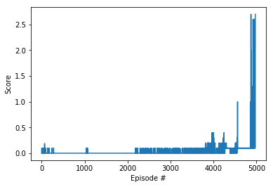

# Tennis project

## Learning Algorithm

The method chosen for solving this environment was the Actor-Critic algorithm Deep Deterministic Policy Gradients ([DDPG](https://arxiv.org/abs/1509.02971))

### Actor Network

The inputs are 8 continuous values representing the state of the environment.
Then there are 2 fully connected Leaky ReLU layers of size 258.
The outputs are 2 continuous values with **tanh** activation representing action values between [-1.0 and 1.0].
The inputs are in the range [-30.0 to 30.0] so they are divided by 30 the be in the range [-1.0 to 1.0].
Additionally the rewards are scaled up by 10 going from [-0.01 to 0.1] to [-0.1 to 1.0].
OUNoise with theta=0.15 and sigma=1.0 is initially replacing the actions by factor 1.0 decaying by 0.995 every episode.

### Critic Network

The inputs are 8 continuous values representing the state of the environment.
Then there is a fully connected Leaky ReLU layer of size 258.
The output of the previous layer is concatenated with the actions (258 + 2) and sent through another Leaky ReLU layer of size 258.
The network output is a single continuous value without activation.
The inputs are in the range [-30.0 to 30.0] so they are divided by 30 the be in the range [-1.0 to 1.0].

### Hyperparameters

These were the hyperparameters used:

    BUFFER_SIZE = int(1e6)  # replay buffer size
    BATCH_SIZE = 64         # minibatch size
    GAMMA = 0.999           # discount factor
    TAU = 1e-3              # for soft update of target parameters
    LR_ACTOR = 1e-5         # learning rate of the actor 
    LR_CRITIC = 1e-4        # learning rate of the critic
    WEIGHT_DECAY = 1e-6     # L2 weight decay

## Plot of Rewards

Several attempts with fixed hyperparameters were done with differing results. Sometimes the environment was solved really fast (<2000 episodes) and sometimes it took longer. This was one of the longer runs and was solved in 4973 episodes:

## Ideas for Future Work

Longer training would probably get the average score even higher.

There is still lots of unexplored territory regarding network architecture (more layers, different sizes, try batch normalization etc).

Other algorithms would be interesting to benchmark against like [PPO](https://arxiv.org/pdf/1707.06347.pdf), [A3C](https://arxiv.org/pdf/1602.01783.pdf) and [D4PG](https://openreview.net/pdf?id=SyZipzbCb)